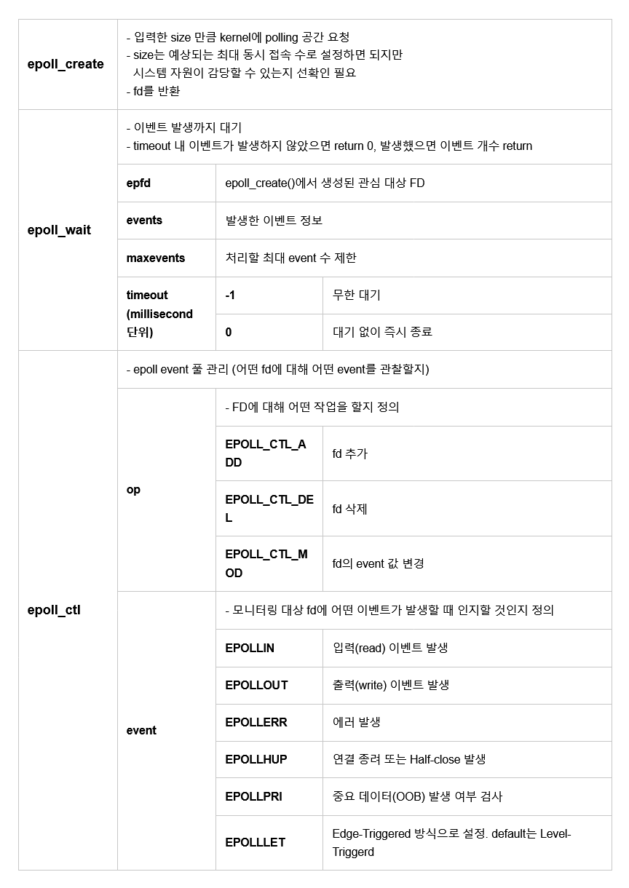

# CK_ChatServer

# 0. INFO

서버 포트 : 25000

최대 인원 : 512

[<클라이언트 - 서버> 메시지 규약](https://www.notion.so/f1fb5b119c9641d4a53f21ad93251822?pvs=21)

서버 소스 : https://github.com/Alice-inNovember/CK_ChatServer by Junseo

클라 소스 : https://github.com/hwahyang1/CK_ChatClient  by KangHyeon

# 1. 개요

<네트워크 기초> 과제로 채팅 프로그램을 만들게 되었다.

강의에서는 연결된 클라이언트마다 하나의 스레드를 생성하는 방법을 설명해 주었으나, 사용하고자  하는 서버의 CPU 수와 성능이 적어, 위의 방법을 사용한 로직은 부적합하다고 생각하였다.

그래서 마지막 수업에서 교수님이 소개해 주신 **소켓 입출력 모델**을 사용하여 채팅 서버를 구현 하고자 하였다.

# 2. **소켓 입출력 모델 I/O Multiplexing**

## 2.1. I/O Multiplexing

**I/O Multiplexing** 은 여러 입출력 작업을 단일 스레드 또는 프로세스에서 관리하는 기술이다. 
이는 다수의 입출력 작업을 동시에 처리할 수 있도록 한다.

기본적으로 프로그램은 입출력 작업이 완료될 때까지 대기하거나, 별도의 스레드나 프로세스를 사용하여 병렬로 처리한다. 
그러나 I/O Multiplexing은 단일 스레드나 프로세스에서 여러 입출력 작업을 모니터링하고, 작업 중 하나가 완료되면 해당 작업을 처리한다.

가장 흔한 I/O Multiplexing 메커니즘으로는 `select`, `poll`, `epoll` (Linux), `kqueue` (FreeBSD, macOS) 등이 있다.
이러한 메커니즘은 여러 소켓이나 파일 디스크립터를 모니터링하고, 상태 변화에 대한 알림을 받아 처리한다.

I/O Multiplexing의 특징은 다음과 같다:

- 이벤트 기반: 이벤트가 발생할 때까지 블로킹되지 않고 대기한다.
- 높은 확장성: 수천 개 이상의 소켓을 동시에 관리할 수 있다.
- 효율적인 입출력 관리: I/O 이벤트 발생 시에만 해당 소켓을 처리하므로, 불필요한 작업을 최소화 한다.

## 2.2. Epoll

epoll은 리눅스에서 사용되는 **I/O Multiplexing 모델 중 하나이다.**

Linux kernel 2.5.44에서 처음 도입되었다.

`poll()`과 마찬가지로 FD의 수는 무제한이지만 `select`, `poll`과 달리 FD의 상태가 kernel에서 관리하여 상태가 바뀐 것을 직접 통지해 준다. → 즉 fd_set를 검사하기 위해 루프를 돌 필요가 없다.

또한 변화가 감지된 FD의 '수'가 아닌 '목록' 자체를 반환받기 때문에 대상 FD를 추가 탐색할 필요가 없어 효율적이다.

### 2.2.1 구조체

```cpp
typedef union epoll_data {
void * ptr;
int fd;
__uint32_t u32;
__uint64_t u64;
} epoll_data_t;
```

```cpp
struct epoll_event {
__uint32_t events; // 발생한 이벤트
epoll_data_t data; // user data 직접 설정 가능
};
```

### 2.2.2 함수들



# 3. 서버 로직

**“Everything is a File”**

먼저 들어가기에 앞서 용어를 통일하고자 한다.

Linux에서는 모든 입/출력, 파일, 파이프 등이 **File**, 더 정확히는 **File Descriptor(FD)**로 관리된다.

소켓도 **FD**로 관리하며 설명에서 말하는 서버 fd, 클라 fd는 모두 각각의 소켓을 가르킨다.

동작 구조는 아래와 같다.

| 1 | svFd (listen fd) 생성 |
| --- | --- |
| 2 | svFd 를 epoll 에 등록 |
| 3 | 서버 루프 시작 |
| 4 | epoll 이 이벤트를 반환하기를 기다림 |
| 4-A | 이벤트가 svFd일 경우 - 새로운 유저 생성 user accept() 및 epoll 에 등록 |
| 4-B | 이벤트가 유저일 경우 - 명령어 처리 및 타 유저에게 메시지 전송 |
| 5 | 루프 반복 |

### 메시지 규약

**클라이언트 → 서버**

첫 로그인시

| 16 | 16 | 512 |
| --- | --- | --- |
| /nick | [nickname] | [없음] |

| 16 | 16 | 512 |
| --- | --- | --- |
| /join | [체널 번호] | [없음] |

메시지 전송

| 16 | 16 | 512 |
| --- | --- | --- |
| [체널 번호] | [nickname] | [메시지] |

/nick

| 16 | 16 | 512 |
| --- | --- | --- |
| /nick | [nickname] | [없음] |

/join

| 16 | 16 | 512 |
| --- | --- | --- |
| /join | [체널 번호] | [없음] |

/leave

| 16 | 16 | 512 |
| --- | --- | --- |
| /leave | [없음] | [없음] |

 /exit

| 16 | 16 | 512 |
| --- | --- | --- |
|  /exit | [없음] | [없음] |

서버 → **클라이언트**

메시지 전송

| 16 | 16 | 512 |
| --- | --- | --- |
| [체널 번호] | [nickname] | [메시지] |

## 3-0 데이터 구조

```cpp
//포트
#define PORT_NBR 25000

//서버 설정
#define MAX_USER 512		// 최대 접속자 수
#define MAX_USER_Q 8		// 최대 접속 대기 큐
#define EP_INIT_SIZE 16		// epoll_create() 초기 크기
#define EP_EVENT_SIZE 16	// epoll_wait() maxevents

//전송 데이터 사이즈
#define DS_TEXT 512	   // text 사이즈
#define DS_ARGV 16	   // 기타 명령어, 아이디, 체널 사이즈

//구조체 typedef
typedef struct sockaddr_in t_sockAddrIn;
typedef struct sockaddr t_sockAddr;
typedef struct epoll_event t_epollEvent;

//개개인의 유저에 대한 정보
typedef struct s_userData
{
	char name[DS_ARGV + 1];
	int ch;
	int fd; //소켓 유닉스 기반 OS에서는 파일로 모든것을 관리
	t_sockAddrIn addr;
} t_userData;

typedef struct s_data
{
	int userState[MAX_USER];
	// 소캣이 정수임으로 해당 인덱스의 값으로 연결여부 확인 가능
	int userChannel[MAX_USER];
	// 소캣이 정수임으로 해당 인덱스의 값으로 연결되어 있는 체널 확인 가능
	t_epollEvent epEvent;
	int epFd;
	int svFd;
} t_data;

#endif
```

## 3-1 svFd 열기

`main()` 에서 데이터를 초기화 한 후 서버의 리슨 fd를 생성한다.

```cpp
static void InitServerSock(t_data* data)
{
	int svFd;
	t_sockAddrIn addr;

	//create
	if ((svFd = socket(AF_INET, SOCK_STREAM, 0)) == -1)
		throw std::string("ERROR  : failed socket()");

	//init
	addr.sin_family = AF_INET;
	addr.sin_port = htons(PORT_NBR);
	addr.sin_addr.s_addr = htonl(INADDR_ANY);

	//option
	int bEnable = 1;
	setsockopt(svFd, SOL_SOCKET, SO_KEEPALIVE, &bEnable, sizeof(int));
	setsockopt(svFd, SOL_SOCKET, SO_REUSEADDR, &bEnable, sizeof(int));
	setsockopt(svFd, IPPROTO_TCP, TCP_NODELAY, &bEnable, sizeof(int));

	//bind
	if (bind(svFd, (t_sockAddr*)&addr, sizeof(t_sockAddrIn)) == -1)
		throw std::string("ERROR  : failed bind()");

	//listen
	if (listen(svFd, MAX_USER_Q) == -1)
		throw std::string("ERROR  : failed listen()");

	data->svFd = svFd;
}
```

`setsockopt`() 빼고는 특별히 설명할 것은 없다.

각각의 옵션의 기능은 아래와 같다.

| SO_KEEPALIVE | 연결상태를 확인하는 옵션 2시간 마다 연결이 유호한지 확인한다. |
| --- | --- |
| SO_REUSEADDR | 커널이 소켓을 사용하는 중에도 계속 사용할 수 있다. 
서버 재시작 시 커널이 소켓의 포트를 아직 점유 중인 경우에 문제를 방지하기 위해 사용한다. |
| TCP_NODELAY | Nagle 알고리즘에 의한 문제점을 해결하기 위해 사용한다. (버퍼 없이 바로 전송) |

## 3-2 Epoll 설정

```cpp
static void InitEpoll(t_data* data)
{
	if ((data->epFd = epoll_create(MAX_USER)) == -1)
		throw std::string("ERROR  : failed epoll_create()");

	data->epEvent.events = EPOLLIN;		   // 이벤트 들어오면 알림
	data->epEvent.data.fd = data->svFd;	   // fd 설정
	//listenfd의 상태변화를 감시 대상에 등록
	if (epoll_ctl(data->epFd, EPOLL_CTL_ADD, data->svFd, &data->epEvent) == -1)
		throw std::string("ERROR  : failed epoll_ctl(), svFd EPOLL_CTL_ADD");
}
```

`epoll_create()` 으로 `epoll` 생성 반환되는 `fd`는 `epoll` 관련 조작 함수를 호출할때 사용됨.

`EPOLLIN` 은 해당 `fd`에 대한 입력이 발생하였을때, 이벤트를 반환하게하는 옵션

`epoll_ctl()` 를 통하여 `svFd` 를 감시대상에 등록

## 3-3 서버루프

```cpp
static void ServerLoop(t_data* data)
{
	t_epollEvent* epEvents;
	int eventCnt;

	epEvents = new t_epollEvent[EP_EVENT_SIZE];
	while (1) {
		eventCnt = epoll_wait(data->epFd, epEvents, EP_EVENT_SIZE, -1);

		if (eventCnt == -1)
			throw std::string("ERROR  : failed epoll_wait()");

		//반환된 eventCnt 만큼 epEvents를 순회하며 수신한 데이터 처리
		for (int evIdx = 0; evIdx < eventCnt; evIdx++) {
			// 새로 연결된 유저(클라이언트)
			if (epEvents[evIdx].data.fd == data->svFd)
				NewUeserEvent(data);
			//기존 유저(클라이언트)
			else
				UserEvent(data, (t_userData*)epEvents[evIdx].data.ptr);
		}
	}
}
```

`epoll` 이 반환할 이벤트를 담을 `epEvents` 배열을 생성한다.

반복문 안에서 `epoll_wait()` 으로 `epoll` 에 등록된 `fd`에서 데이터가 수신되기를 기다린다

이벤트 리스트가 반환되면, 그 리스트를 순회하면서 데이터를 처리한다.

만약 반환된 이벤트 데이터 `fd` 가 `svFd` 일 경우 `NewUeserEvent()` 가 호출 된다.

만약 반환된 이벤트 데이터 `fd` 가 `svFd` 아닐 경우 `UserEvent()` 가 호출 된다.

## 3-3 NewUeserEvent()

```cpp
void NewUeserEvent(t_data* data)
{
	int userFd;
	t_userData* userData;
	t_epollEvent epEvent;

	socklen_t cliLen;

	//user accept()
	cliLen = sizeof(t_sockAddr);
	userFd = accept(data->svFd, (t_sockAddr*)&addr, &cliLen);
if (userFd == -1) 
	return;

	//서버 로그 생략 (addr 등등)
	//소켓 옵션 생략 (svFd 와 동일)

	//userData 초기화
	userData = new t_userData;
	userData->fd = userFd;
	userData->ch = 0;
	userData->addr = addr;
	memset(userData->name, 0, sizeof(userData->name));

	data->userState[userFd] = 1;	  // 연결 처리
	data->userChannel[userFd] = 0;	  // 체널

	epEvent.data.ptr = userData;	// 데이터 추가
	//epoll 등록 생략
}
```

`accept()` 를 통해 새 클라이언트 수락

소캣 옵션 설정 (`svFd` 와 동일)

`userData` 생성후 값 초기화

`data->userState` 의 `fd` 번째 값을 `1`로 바꾸어 해당 `fd`가 유효함을 나타냄

`data->userChannel` 의  `fd` 번째 값을 체널 번호로 바꾸어 `fd`의 유저가 속한 체널을 표시함

`epEvent.data.ptr` 에 생성한 `userData` 주소 저장

소캣 을 `epoll` 에 등록 (`svFd` 와 동일)

## 3-4 UeserEvent()

```cpp
// 유저(client) Fd 에서 이벤트시 호출
void UserEvent(t_data* data, t_userData* userData)
{
	char arg1[DS_ARGV + 1];
	char arg2[DS_ARGV + 1];
	char text[DS_TEXT + 1];

	//데이터 수신
	try {
		readSockFd(userData->fd, arg1, DS_ARGV);
		readSockFd(userData->fd, arg2, DS_ARGV);
		readSockFd(userData->fd, text, DS_TEXT);
		arg1[DS_ARGV] = 0;
		arg2[DS_ARGV] = 0;
		text[DS_TEXT] = 0;
	}
	//읽기 실패시 유저 삭제
	catch (std::string msg) {
		//서버 로그 생략
		RemoveUser(data, userData);
		return;
	}
	
	//명령어 처리
	(따로 분리)
}
```

readSockFd()를 호출하여 arg1, arg2, text 에 수신된 데이터를 담는다.

읽기 실패시 RemoveUser()를 호출하여 해당 fd을 close() 후 리턴한다.

그리고 읽은 데이터에 따라서 아래의 로직에 따라서 처리한다.

**nick chainge**

```cpp
  //nick chainge
	if (std::string(arg1) == std::string("/nick")) {
		memcpy(userData->name, arg2, DS_ARGV);

		char temp[DS_TEXT];
		memset(temp, 0, DS_TEXT);
		sprintf(temp, "NickName Changed to : %s", userData->name);
		SendNotification(userData->fd, temp);
	}
```

arg1 가 "/nick" 일 경우

memcpy() 로 userData->name 에다가 복사한다.

명령어를 보낸 유저에게 NickName Changed to : [닉네임] 메세지를 보냄

**join channel**

```cpp

	//join channel
	else if (std::string(arg1) == std::string("/join"))
	{
		userData->ch = atoi(arg2);
		data->userChannel[userData->fd] = atoi(arg2);

		char temp[DS_TEXT];
		memset(temp, 0, DS_TEXT);
		sprintf(temp, "Joind Channel : %d", userData->ch);
		SendNotification(userData->fd, temp);
	}
```

arg1 가 "/join" 일 경우

arg2 를 atoi() 로 정수로 변환

userData->ch 을 해당 체널로 설정

data->userChannel[userData->fd] 을 해당 체널로 설정

명령어를 보낸 유저에게 Joind Channel : [체널] 메세지를 보냄

**leave channel**

```cpp
  //leave channel
	else if (std::string(arg1) == std::string("/leave"))
	{
		userData->ch = 0;
		data->userChannel[userData->fd] = 0;

		char temp[DS_TEXT];
		memset(temp, 0, DS_TEXT);
		sprintf(temp, "Joind Channel : %d", userData->ch);
		SendNotification(userData->fd, temp);
	}
```

arg1 가 "/leave" 일 경우

userData->ch 을 초기값 체널 0으로 설정

data->userChannel[userData->fd] 을 초기값 체널 0으로 설정

명령어를 보낸 유저에게 Joind Channel : 0 메세지를 보냄

```cpp
 	//send msg
	else
	{
		SendMessage(data, userData, arg1, arg2, text);
	}
```

```cpp
void SendMessage(t_data* data, t_userData* userData, char* arg1, char* arg2,
				 char* msg)
{
	char* buff = CombinedMessage(arg1, arg2, msg);

	for (int i = 0; i < MAX_USER; i++) {
		//접속된 유저이면
		if (userData->fd == i)
			continue;
		if (data->userState[i] == 1 && data->userChannel[i] == atoi(arg1)) {
			write(i, buff, DS_ARGV + DS_ARGV + DS_TEXT);
		}
	}
	delete[] buff;
}
```

arg1 가 "/leave" 가 아닐 경우

수신한 메시지를 연결된 모든 유저를 순회하며 같은 체널에 있는 타 유저에게 메시지를 전송한다.

## 3-5 오류처리 및 종료

```cpp
catch (std::string msg) {
		std::cerr << C_ERROR << msg << C_NOMAL << std::endl;
		std::cerr << C_NOMAL << "TIME   : " << pTime() << std::endl;
		std::cerr << C_NOMAL << std::endl;
		return (-1);
	}

	std::cout << C_STATE << "SERVER : Server End!" << C_NOMAL << std::endl;
	std::cerr << C_NOMAL << "TIME   : " << pTime() << std::endl;
	std::cerr << C_NOMAL << std::endl;
```

ServerLoop() 에서 오류 발생시 현 시간(UTC) 과 오류 메시지를 콘솔에 출력 후 비정상 종료

루프 정상 종료시(해당 조건 불가능) 현 시간(UTC) 과 오류 메시지를 콘솔에 출력 후  종료

# 3. 소감

학기동안 배운 내용을 복습하며, 결과가 있는 프로젝트를 작업하는것에 기쁨을 느꼈다.

강의만 들었을때, 확실히 이해한 것인지 확실하지 않았던 부분들을 보다 완벽히 이해하고 습득 할 수 있었고, 강의 내용을 확장한 epoll등을 활용함으로써 유익한 배움의 시간이었던 것 같다.

김강현(화향) 님과의 협업도 너무 즐거웠고 보다 완성도 있는 결과물이 나오게 되어 기쁘다.
